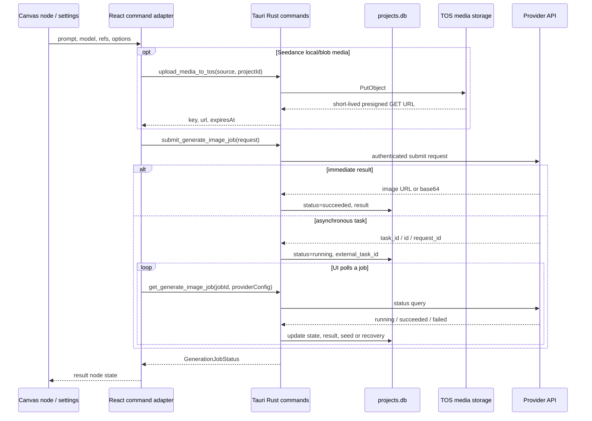

# 旧 Lumina 的图片、视频和文本 API 接入报告

## 摘要

本文基于旧项目 `E:\project\lumina` 的 `main` 分支提交
`77e6d1eadd254dc8f96a008f9fae8961b0a70d7f`（应用版本 `0.2.32`）整理。
结论是：旧 Lumina 是一个 **Tauri 本地桌面客户端直连第三方 Provider** 的架构。
React 不直接发出 Provider HTTP 请求；它以 `invoke()` 调用 Rust command，Rust 端持有
Provider 实例和内存中的 API Key、构造 HTTP 请求，并把可恢复任务写入本机
SQLite。文本生成则按调用携带的 `base_url`、`api_key` 直接请求 OpenAI 兼容接口。

这是一份实现还原，不代表这些第三方 API 当前仍可用，也不包含真实密钥或签名 URL。

| 主题 | 旧实现的主要做法 |
| --- | --- |
| 图片 | 一个统一 DTO；Rust `AIProvider` 用同步返回或 `submit -> poll` 归一化 |
| 视频 | Seedance/VolcVideo 专用 typed content；先把本地媒体上传至 TOS，交给 Provider 的是临时 HTTP(S) URL |
| 文本 | 一次性请求；`/api/v3`（非 `/coding`）走 Responses，其他走 Chat Completions |
| 提示词润色 | 独立 `polish_text` command；先套图像/文本/视频模板，再调用文本模型 |
| 任务恢复 | `projects.db.ai_generation_jobs` 保存任务状态、外部任务 ID、结果和退避信息；不保存 API Key |

## 范围和读取方法

范围为画布内的图片生成、视频生成、文本生成、提示词润色、引用媒体传递和模型发现。
不含本地裁剪、Real-ESRGAN、项目快照或已生成媒体的 UI 渲染实现。

代码验证顺序：前端 command 包装与网关 -> Rust command DTO/任务表 -> Provider adapter
-> TOS 媒体通路。文中 `路径:行号` 是该固定提交的源码定位。

## 总调用链



调用路径证据见本文末尾 `P-001`。

## 前端与 Tauri 的公共契约

### 图片/视频生成 DTO

前端定义在 `src/commands/ai.ts:5`，网关将 camelCase 字段转换为 Rust DTO 的
snake_case 字段（`src/features/canvas/infrastructure/tauriAiGateway.ts:107`）。请求语义如下：

```ts
interface GenerateRequest {
  prompt: string;
  model: string;                     // 如 "volcvideo/doubao-seedance-..."
  provider_id?: string;              // 显式选择已注册 Provider
  size: string;                      // 图片 1K/2K/4K，视频 720p 等
  aspect_ratio: string;
  reference_images?: string[];       // URL、data URL 或本地来源，按 Provider 规整
  video_content?: Array<{
    type: 'text' | 'image_url' | 'video_url' | 'audio_url';
    role?: string;
    url?: string;
    text?: string;
  }>;
  extra_params?: Record<string, unknown>;
  provider_config?: Record<string, string>; // 常见为 api_key、base_url
  draftTaskId?: string;
  project_id?: string;               // 前端保留字段
}
```

Rust 侧 `GenerateRequestDto` 位于 `src-tauri/src/commands/ai.rs:44`。它接受前七个业务字段、
`extra_params`、`provider_config` 和 `draftTaskId`，但 **没有** `project_id` 成员。因此画布
生成 command 不用 `project_id`；它只在 TOS 上传 command 中作为对象 key 的项目分段使用。

异步接口由四个 Tauri command 组成：

| 前端函数 | Tauri command | 返回值/作用 |
| --- | --- | --- |
| `setApiKey` | `set_api_key` | `void`；将 key 写入已注册 Provider 的 `RwLock<Option<String>>` |
| `submitGenerateImageJob` | `submit_generate_image_job` | 本地 UUID `job_id` |
| `getGenerateImageJob` | `get_generate_image_job` | `GenerationJobStatus`，必要时代表前端发起一次 Provider 查询 |
| `retryGenerateImageJob` | `retry_generate_image_job` | 对达到退避上限的任务进行一次人工重查 |
| `generateImage` | `generate_image` | 旧的同步包装，直接返回 `string` 图片来源 |

轮询结果的统一 DTO 在 `src/commands/ai.ts:21`：

```ts
type GenerationJobStatus = {
  job_id: string;
  status: 'queued' | 'running' | 'succeeded' | 'failed' | 'not_found' | 'cancelled';
  result?: string | null;             // URL 或 data:image/...;base64,...
  error?: string | null;
  seed?: number | null;               // 当前主要来自视频 Provider
  external_task_id?: string | null;
  recovery?: {
    retry_count: number;
    next_retry_at?: number | null;
    requires_manual_requery: boolean;
    last_error?: string | null;
  } | null;
};
```

### Provider 选择和注册边界

`get_registry()` 只实例化 `build_default_providers()` 所列的 Provider
（`src-tauri/src/commands/ai.rs:29`、`src-tauri/src/ai/providers/mod.rs:28`）。优先用
显式 `provider_id`，否则根据 `model` 前缀解析；找不到时才使用默认 Provider。

当前默认注册的 Provider 是：

| Provider ID | 实现 | 可恢复任务 |
| --- | --- | --- |
| `openai` | OpenAI Images 兼容适配器 | 否 |
| `ai-media` | OpenAI Images 兼容异步适配器 | 是 |
| `chaomo` | OpenAI Images 兼容异步适配器 | 是 |
| `fhl` | OpenAI Images 兼容适配器 | 否 |
| `gemini` | Gemini Native 图片适配器 | 是 |
| `codingplan` | 文本/视觉 Chat 适配器 | 否 |
| `volcvideo` | Seedance 视频适配器 | 是 |

`fal`、`kie`、`grsai`、`ppio`、`runninghub`、`bltcy` 模块虽然存在且有模型定义，
但在本提交的默认注册列表中没有被实例化。因此不能仅因设置页或模型 registry 出现其模型
就断定用户运行时可以经由 `submit_generate_image_job` 调到它们。

## 图片 Provider 的请求和返回

### 已注册的 OpenAI Images 家族

同一个 `OpenAiProvider` 通过协议枚举承载四种配置；代码在
`src-tauri/src/ai/providers/openai.rs:21` 至 `:45` 和 `:497` 至 `:646`。

| ID | 默认 Base URL | 生成请求 | 编辑请求 | 成功解析 |
| --- | --- | --- | --- | --- |
| `openai` | `https://api.openai.com/v1` | `POST /images/generations` JSON：`model,prompt,size,n,quality?` | `POST /images/edits` multipart：`model,prompt,n,size,quality?,image/image[]` | `data[0].b64_json` 转 data URL，或 `data[0].url` |
| `ai-media` | `https://api.ai-media.vip/v1` | 同路径，`size,n,response_format=b64_json,quality?,async=true` | 同路径 multipart，附 `async=true` | 同上；异步接收 `task_id/id/request_id` |
| `chaomo` | `https://www.chaomoapi.com/v1` | JSON：`model,prompt,ratio,n,response_format=url,async=true,quality?` | multipart；部分 Hight 模型拒绝引用图 | URL 或任务回执 |
| `fhl` | `https://www.fhl.mom/v1` | JSON：`model,prompt,n,size,quality=auto,output_format=png,response_format=b64_json` | multipart；首张为 `image`，其余为 `image[]` | base64 或 URL |

所有上述请求使用 `Authorization: Bearer <key>`。可覆盖 `provider_config.api_key` 和
`provider_config.base_url`；否则使用 `set_api_key` 预先写进 Provider 内存的 key。
`ai-media` 在提交时加 `Idempotency-Key: opencanvas-image-<uuid>`，其余协议未加该头。

对异步回执，适配器保存 `base_url`、可选 `status_url/poll_url` 到 task metadata；轮询成功状态为
`success/succeeded/completed`，失败状态为 `failed/cancelled/canceled`。最终图片来源支持：

```json
{
  "data": [{"b64_json": "...", "media_type": "image/png"}]
}
```

或 `data[0].url`、`assets[0].signed_url`、`assets[0].url`、`output.url`。
Base64 会被归一化成可显示的 `data:<mime>;base64,...`。

### Gemini Native 图片

实现位于 `src-tauri/src/ai/providers/gemini.rs:341` 至 `:628`。请求为：

```text
POST {base_url}/models/{urlencoded-model}:generateContent
x-goog-api-key: <key>
Content-Type: application/json
```

请求体由 `contents` 构成：文本放入 `parts[].text`，引用图片被编码为
`parts[].inlineData { mimeType, data }`。如果自定义网关误留 `/v1` 并得到 HTML 404，
代码只针对这一种情况把路径回退到 `/v1beta` 再试一次。

同步返回从 `candidates[].content.parts[].inlineData` 中抽取，生成 data URL；网关型异步回执
识别 `task_id/id/request_id` 和可选 `status_url`，之后以 `x-goog-api-key` 查询任务。若原请求
使用了 request-level `api_key`，task metadata 记录 key 指纹而非明文，并在进程内暂存关联 key；
重启后可用再次传入的 `provider_config.api_key` 重查。

### 源码已实现但未默认注册的图片 Provider

下表可用于迁移时复用 adapter 思路，但不应视为本提交的可运行默认能力。

| Provider | 鉴权和提交 | 任务/结果解析 |
| --- | --- | --- |
| FAL | `POST https://queue.fal.run/{model-path}`，Bearer；按有无引用图选择 t2i 或 `/edit` 路径 | 回执 `request_id`；优先用回执 URL，后备请求 `/requests/{id}/status` 和 `/requests/{id}`；从 `response.images[0].url` 提取 |
| KIE | 本地/data 引用图先 multipart 上传到 `https://kieai.redpandaai.co/api/file-stream-upload`；再 `POST https://api.kie.ai/api/v1/jobs/createTask` | `data.taskId`；`GET /api/v1/jobs/recordInfo?taskId=...`；`resultJson` 中的 URL |
| GRSAI | Bearer；`POST /v1/draw/nano-banana`，编码的引用图作为请求字段 | 回执 `data.id`；`POST /v1/draw/result`，体为 `{id}`；`running/success/failed` 归一化 |
| RunningHub | 小图 data URL；大图先 multipart 上传 `/openapi/v2/media/upload/binary`，失败后仍回落 data URL；随后 JSON 提交 | 回执 `taskId`；`POST /openapi/v2/query`，体为 `{taskId}`；`SUCCESS` 的 `results[0].url` |
| PPIO | `POST https://api.ppio.com/v3/gemini-3.1-flash-image-{text-to-image|edit}`，Bearer JSON | 直接读取 `image_urls[0]`，无轮询 |
| BLTCY | `POST https://api.bltcy.ai/v1/images/edits`，Bearer multipart：`model,prompt,response_format=url,image...` | 同步解析多种 URL/base64 字段，返回第一张图 |

这些模块都保留了“读取本地或 data URL -> 转为 Provider 可接受格式 -> 只把最终 URL 返回画布”的
边界；但是它们的重试、图片大小限制、临时 URL 策略并不一致。

## 视频（VolcVideo / Seedance）

### 画布输入的强类型计划

`seedanceVideoRequestPlan.ts:1` 在调用 Provider 前建立两类请求：

| 模式 | 允许输入 | 产出 `video_content` |
| --- | --- | --- |
| strict-frame | 1--2 张图片，不能有视频/音频 | 第一张为 `image_url/first_frame`，第二张为 `image_url/last_frame`，再附一项 text |
| automatic | 最多 9 图、3 视频、3 音频；音频必须配视觉引用 | 图/视频/音频分别为 `reference_image/reference_video/reference_audio`，再附一项 text |

Seedance 2.0 还在前端校验模型、分辨率和 4--15 秒时长。提交时不再把 prompt 和 typed content
重复序列化：如果已有 typed content，text 必须由 content 数组中的 `type: text` 项表达。

### 媒体先上传，再提交视频任务

`tauriAiGateway.normalizeReferenceImages` 和 `normalizeVideoContent`
（`src/features/canvas/infrastructure/tauriAiGateway.ts:54`、`:91`）将视频所需的 `blob:`、
本地路径或 data URL 先物化/上传。TOS command 返回：

```ts
type TosUploadResult = {
  key: string;
  url: string;          // 短期 presigned GET URL
  expiresAt: number;
  contentType: string;
  sizeBytes: number;
};
```

Rust 的 `typed_source_to_public_url` 只接受 HTTP(S)，所以 typed content 不会把 `file:`、
`asset:`、`blob:` 或裸路径交给 Seedance（`volcvideo.rs` 的 typed content 构造）。
TOS 实现上传对象时设 `Cache-Control: private, max-age=0, no-cache`，然后为 GET 生成预签名 URL；
默认有效期为 3600 秒，最大可配置为 86400 秒（`storage/tos.rs:18`、`:147`、`:194`）。

### Seedance HTTP 协议

Provider 实现为 `src-tauri/src/ai/providers/volcvideo.rs`。`provider_config` 提供运行时
`base_url` 和 `api_key`（或回退到 `set_api_key` 的内存值）。实际请求：

```text
POST {base_url}/api/v3/contents/generations/tasks
Authorization: Bearer <api_key>
Content-Type: application/json
```

典型请求体：

```json
{
  "model": "doubao-seedance-2-0-260128",
  "content": [
    {"type": "image_url", "role": "first_frame", "image_url": "https://..."},
    {"type": "text", "text": "A rainy city at night"}
  ],
  "generate_audio": true,
  "resolution": "720p",
  "ratio": "16:9",
  "duration": 5,
  "seed": 42,
  "camera_fixed": false,
  "watermark": false
}
```

`duration`、`seed`、`camera_fixed`、`watermark`、`draft` 和 `tools` 是可选项；`extra_params`
用于映射这些高级选项。草稿模式还可携带 `draft_task`，而非重复上传原始素材。

提交从 `id` 或 `task_id` 得到外部任务 ID。轮询和取消分别是：

```text
GET    {base_url}/api/v3/contents/generations/tasks/{taskId}
DELETE {base_url}/api/v3/contents/generations/tasks/{taskId}
```

结果兼容 `output_url`、`data.video_url/output_url` 和
`content: [{ type: "video", video_url }]`。`succeeded/success` 转为 `SucceededWithMeta {url, seed}`；
`creating/submitted/queued/running/processing` 为运行中；`failed/cancelled/expired` 为失败。

## 文本生成和提示词润色

### 普通文本节点

前端先把 `blob:` 与本地来源转换为 data URL；HTTP(S) 和 `data:image/` 原样保留
（`textGenerationService.ts:49`）。调用携带 `text, model, api_key, base_url,
reference_images?, reasoning_effort?`。

后端选择协议的规则是字符串兼容策略，而非模型能力探测：当 `base_url` 包含 `/api/v3` 且不包含
`/coding` 时走 Responses；其余走 Chat Completions（`commands/ai.rs:2327`）。

| 协议 | endpoint 规整 | 请求核心 | 结果提取 |
| --- | --- | --- | --- |
| Chat Completions | `base_url/chat/completions`；若是 `/api/coding` 则补 `/v3/chat/completions` | `model,messages:[{role:user,content}]`, `stream:false`, `reasoning_effort?`；图像为 `image_url` content part | `choices[0].message.content` |
| Responses | `base_url/responses` | `model,input:[{role:user,content}]`, `reasoning:{effort}?`；图像为 `input_image` | `output_text`，或 choices/message/content，或遍历 `output[].content[].text` |

无论哪条路径，空模型/空 key/“文本与引用图都为空”都会在请求前失败；图片只接受
HTTP(S) 或 `data:image/`。

### 提示词润色

`polishText` 并不复用普通文本节点的简化 payload，而是调用独立 `polish_text`
（`textPolishService.ts:125`、`commands/ai.rs:2408`）。它接受图、文本、视频三类默认模板，
可覆盖 `custom_prompt`，并可附：视频时长、分辨率、比例、镜头参数、首尾帧标志和
`reasoning_effort`。

- Chat 路径把模板放在 `system` 消息，把待润色内容和图像放在 `user` 消息。
- Responses 路径把模板和待润色内容合并为 `input_text`，图像各自为 `input_image`。
- 视频固定参数会先拼入用户待润色文本，避免模型忽略 UI 中已选择的时长、分辨率、比例或首尾帧模式。

`test_text_api` 例外地总是使用 Chat Completions，因此它不能完整证明 `/api/v3` 的
Responses 路径可用。

## 本地任务状态、重试和错误

任务库是应用数据目录中的 `projects.db`，表为 `ai_generation_jobs`
（`src-tauri/src/commands/ai.rs:106`、`:118`）。关键列有：

```text
job_id, provider_id, status, resumable,
external_task_id, external_task_meta_json,
result, error,
poll_retry_count, next_poll_at,
recovery_requires_manual_requery, recovery_error,
created_at, updated_at
```

- 可恢复 Provider 提交后保存远端任务 ID；直接成功时立刻保存结果。
- 不可恢复 Provider 仍会插入 `running` 记录，但实际 `generate()` 在 Tauri 进程内异步运行；
  进程退出后没有足够的远端 handle 自动续跑。
- 对轮询网络错误和 HTTP `408/425/429/5xx`，Rust 记录恢复状态而非把任务标为失败。
  退避为带稳定抖动的指数退避，基线 1 秒、封顶 30 秒；连续 5 次后设置
  `requires_manual_requery=true`。
- Provider 的业务失败、无效 JSON、无结果 URL 等则写入 `failed` 和 error 字段。

API Key 没有写入任务表。Provider key 的默认存储是进程内 `RwLock`；需要恢复的 VolcVideo 和
Gemini 查询由前端在 `get_generate_image_job(jobId, providerConfig)` 再传入当前配置。这避免将 key
写入 SQLite，但也意味着仅有数据库任务记录不足以在另一台机器或失去配置后继续查询。

## 对新架构迁移有价值的结论

1. 保留统一的内部任务模型，而不是把每个 Provider 的回执直接泄漏到画布：
   `Queued(task_id) / Succeeded(source)` 和 `Running / Succeeded / Failed` 已经是适合适配层的最小契约。
2. 视频输入必须在 Provider 边界前变成短期可访问 URL；data URL、本地路径和 object URL 是本地表示，
   不应当被误认为 Provider 可取回的地址。
3. 任务恢复的持久化单位应是无凭据 task handle、状态和必要的非敏感 metadata；重新查询时再从受控
   配置边界取得凭据。旧实现的 in-memory key 绑定说明不能把“保存了 task ID”误写成“无需配置即可恢复”。
4. 将 Base URL 路由建立在 `/api/v3` 字符串启发式上是历史兼容行为。新的 Gateway 应以配置中显式的
   协议类型决定 request builder，并让 API 测试走同一 protocol path。
5. `project_id` 在前端生成 DTO 与 Rust DTO 的不一致应在迁移时消除：要么从外层 payload 删除，
   要么明确纳入任务/审计用途；不要依赖 serde 对未知字段的默认忽略行为表达业务语义。

## Evidence、findings 和调用路径

### E-001

- title: 前端到 Tauri 的图片任务 DTO 和轮询结果契约
- source_type: file
- source_ref: `src/commands/ai.ts:5`, `src/commands/ai.ts:30`, `src/features/canvas/infrastructure/tauriAiGateway.ts:107`
- content_hash: n/a
- artifact_path: n/a
- repro_command: `rg -n "export interface GenerateRequest|export interface GenerationJobStatus|submitNormalizedGenerateImageJob" src/commands/ai.ts src/features/canvas/infrastructure/tauriAiGateway.ts`
- raw_excerpt: 前端通过 `invoke` 提交 job ID，再读取统一的 status/result/error/recovery。
- linked_workitem: n/a
- supersedes: none

### E-002

- title: 默认 Provider 注册表与可恢复能力
- source_type: file
- source_ref: `src-tauri/src/commands/ai.rs:29`, `src-tauri/src/ai/providers/mod.rs:28`
- content_hash: n/a
- artifact_path: n/a
- repro_command: `rg -n "get_registry|build_default_providers|supports_task_resume" src-tauri/src/commands/ai.rs src-tauri/src/ai/providers/mod.rs`
- raw_excerpt: command registry 只注册七个默认 Provider，且其 task resume 能力显式列出。
- linked_workitem: n/a
- supersedes: none

### E-003

- title: Seedance 的媒体上传和 typed content 约束
- source_type: file
- source_ref: `src/features/canvas/infrastructure/tauriAiGateway.ts:44`, `src-tauri/src/commands/storage.rs:16`, `src-tauri/src/storage/tos.rs:147`, `src-tauri/src/ai/providers/volcvideo.rs:855`
- content_hash: n/a
- artifact_path: n/a
- repro_command: `rg -n "uploadSeedanceMedia|upload_media_to_tos|pub async fn upload_media|typed_source_to_public_url|submit_task" src/features/canvas/infrastructure/tauriAiGateway.ts src-tauri/src/commands/storage.rs src-tauri/src/storage/tos.rs src-tauri/src/ai/providers/volcvideo.rs`
- raw_excerpt: 前端先上传媒体，Rust 签发 URL，视频 Provider 仅提交可公开读取的 HTTP(S) typed media。
- linked_workitem: n/a
- supersedes: none

### E-004

- title: 文本协议构造与响应兼容解析
- source_type: file
- source_ref: `src-tauri/src/commands/ai.rs:2141`, `src-tauri/src/commands/ai.rs:2187`, `src-tauri/src/commands/ai.rs:2232`, `src-tauri/src/commands/ai.rs:2327`
- content_hash: n/a
- artifact_path: n/a
- repro_command: `rg -n "build_generate_text_(chat|responses)_request|extract_generated_text|pub async fn generate_text" src-tauri/src/commands/ai.rs`
- raw_excerpt: Chat 和 Responses 有不同 body，结果解析接纳多个供应商返回形状。
- linked_workitem: n/a
- supersedes: none

### F-001

- title: 旧架构将 Provider 协议差异收束在 Tauri adapter
- severity: n/a_re
- category: design
- status: validated
- evidence_ids: [E-001, E-002]
- location: `src-tauri/src/ai/mod.rs:44`, `src-tauri/src/commands/ai.rs:1443`
- impact: 画布只面对统一 job 状态，Provider 可同步或异步完成。
- confidence: high
- repro_steps:
  1. 查看 `AIProvider` 的 submit/poll/generate 三种能力。
  2. 查看 command 根据 `supports_task_resume` 分为持久任务和进程内任务。
- remediation: n/a

### F-002

- title: 视频 Provider 输入依赖临时外部媒体 URL
- severity: n/a_re
- category: design
- status: validated
- evidence_ids: [E-003]
- location: `src/features/canvas/infrastructure/tauriAiGateway.ts:54`, `src-tauri/src/ai/providers/volcvideo.rs`
- impact: 本地媒体不可直接作为 Seedance typed content；TOS URL 到期后不能作为持久项目事实。
- confidence: high
- repro_steps:
  1. 观察前端在视频分支调用 `uploadMediaToTos`。
  2. 观察 Rust typed source validator 仅允许 HTTP(S)。
- remediation: 新架构继续将媒体可访问性限定在受控短期 delivery 层。

### P-001

- title: 画布图片/视频任务调用路径
- path_type: callflow
- start: 画布节点提交 prompt、模型与引用媒体
- goal: 结果节点获得标准化 URL/data URL 或失败状态
- steps:
  1. action: 前端规整引用图和 typed video content。evidence: E-001, E-003. finding: F-002
  2. action: Tauri 选择已注册 Provider 并提交任务。evidence: E-002. finding: F-001
  3. action: 可恢复 Provider 保存远端 task ID；非可恢复 Provider 在进程内执行。evidence: E-002. finding: F-001
  4. action: 前端按 job ID 查询，Rust 将 Provider 状态映射回统一 DTO。evidence: E-001. finding: F-001
- residual_risks: 凭据不在任务表内；临时 TOS URL 会过期；未默认注册的 Provider 需要先被纳入 registry 才能从此路径调用。

## 验证记录

- 已检查旧仓库当前为 `main`，工作区干净。
- 已核对固定提交 `77e6d1eadd254dc8f96a008f9fae8961b0a70d7f` 和版本 `0.2.32`。
- 本次是源码分析和文档新增，未调用真实第三方 API，未读取或输出任何本地配置的密钥。
